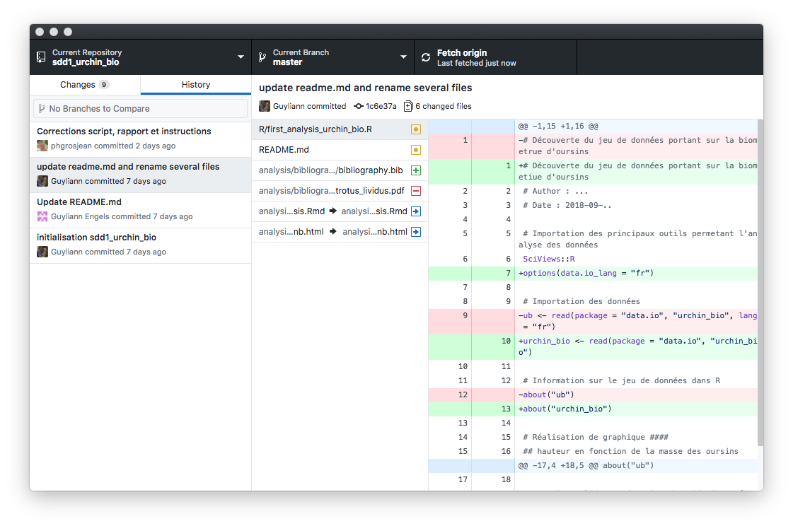

```{r setup, include=FALSE}
knitr::opts_chunk$set(echo = TRUE)
SciViews::R
```

# Git and Github

## What is Git?

### Why a version-control system?

\centering


### Why a version-control system?

\centering


### What is Git?

**Git is a version-control system**

- We "see" only one version in the folders it manages

- But *all* versions are recorded

- It is possible to return to any version at any time

- It is possible to navigate through the history and to display *"diffs"* between versions for text files

- A new version is registered by **a commit** in Git parlance

### Git history management in Github Desktop



### How to do in RStudio?

- Create a new **project** in RStudio and **activate Git** for this project

- A **Git** tab appears. You can do almost everything related to Git from there

- Select modified files and commit them

- Each time a commit is done, you have to provide an explicit message and it will be useful later on to navigate in the history

## What is Github?

### Save and share Git projects on the cloud

\columnsbegin
\columnsmall

- Many solutions exist to store files on the cloud: Google Drive/Docs, One Drive, iCloud, Dropbox, ...

- Github, Gitlab, or Bitbucket (among others) allow to store your files in a Git-versioned way

\columnlarge


\columnsend

### Fork a Github repository and clone it to use it locally

\centering


